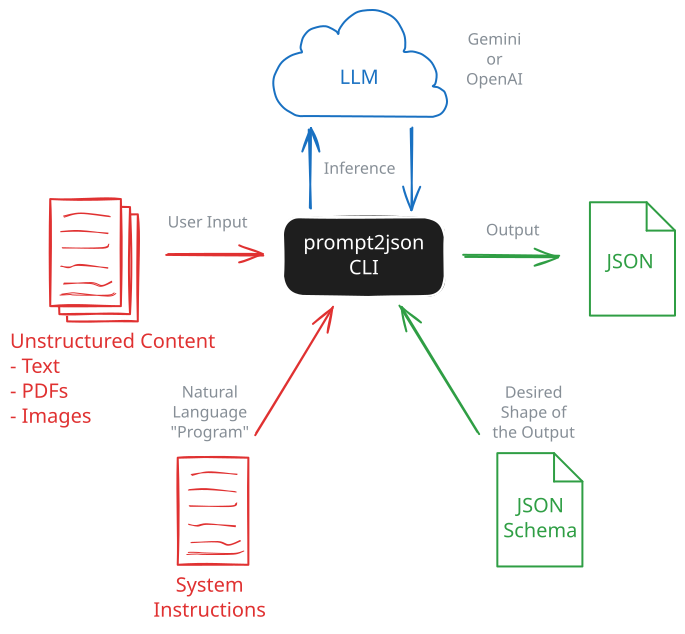

# prompt2json

Unix-style CLI that brings English-as-Code to your command line. Define behavior in natural language, specify output structure with JSON Schema, and get reliable structured data back for automation and batch processing.

## What it does

- Turn free form prompts into machine reliable JSON for automation and batch workflows
- Enforce output shape using JSON Schema rather than post processing heuristics
- Make LLMs usable in shell pipelines, scripts, and data processing jobs
- Enable repeatable, inspectable prompt experiments from the command line
- Treat LLM calls as deterministic interfaces, not interactive sessions
- Supports plain text inputs and inline attachments (`.png`, `.jpg`, `.jpeg`, `.webp`, `.pdf`)
- Works with Vertex AI Gemini models and OpenAI-compatible Chat Completions endpoints

## Providers

The `--provider` flag is required and determines which API format to use:

| Provider | Description | Default URL |
|----------|-------------|-------------|
| `gemini` | Vertex AI Gemini models | Constructed from `--project` and `--location` |
| `openai` | OpenAI-compatible Chat Completions API | `https://api.openai.com/v1/chat/completions` |

The `openai` provider works with OpenAI, Google Cloud's OpenAI-compatible endpoint, Ollama, and other compatible services.
Some OpenAI-compatible endpoints may reject multimodal attachment payloads even when text-only requests work.

## Why prompt2json?

Traditional solutions for handling unstructured content require either building brittle rule-based systems or training specialized machine learning models. Both approaches demand significant upfront engineering effort and struggle with evolving requirements. Large language models unlock powerful capabilities, but their common chat-oriented interfaces make them difficult to use as reliable building blocks in automation. While agentic workflows address some of these limitations, they introduce additional complexity and are not always a natural fit for simple, composable pipelines.

`prompt2json` takes a different approach. It treats LLMs as flexible cognitive components that can be directed with simple English instructions. You describe what you want (in English), define the output (with JSON Schema), and let the LLM handle the hard part.

The key is predictability. By constraining the LLM's output to match a JSON Schema, you get parsable, structured results that integrate cleanly into shell pipelines, scripts, and data processing workflows. No more parsing freeform text or dealing with unpredictable output formats.
